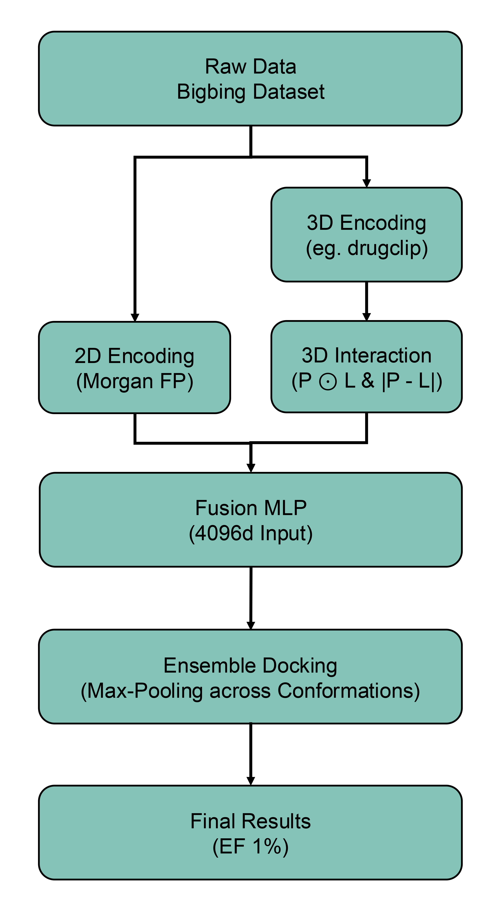

# Fusion-VS: End-to-End 3D+2D Ensemble Pipeline for Virtual Screening

This repository implements an advanced, end-to-end deep learning pipeline for high-throughput virtual screening (VS). Unlike standard rigid docking or pure 2D topological models, our approach pioneers the integration of **3D+2D Feature Fusion** on the Uni-Mol/DrugCLIP backbone. By seamlessly coupling this multi-dimensional representation with a Dynamic Ensemble Docking strategy, we provide a robust, high-fidelity framework that successfully overcomes analog bias and achieves state-of-the-art early enrichment on rigorous datasets like LIT-PCBA and DUD-E.

## ✨ Key Innovations

* **Multi-Dimensional Feature Fusion**: We directly integrate 2048-dimensional Morgan fingerprints with 3D spatial embeddings derived from the Uni-Mol/DrugCLIP structural prior. This hybrid architecture captures both macro-topological properties and micro-spatial interfacial dynamics, effectively eliminating false positives caused by 2D analog bias.

* **Dynamic Ensemble Docking**: Our evaluation architecture inherently accounts for protein flexibility. By mapping ligands against multiple receptor conformations and applying a Max-Pooling logic, we achieve expert-level virtual screening performance.

## 📋 Pipeline Overview

The end-to-end generative workflow operates in three distinct phases:

1. **High-Speed Feature Encoding (SSD Staging)**: Parse millions of candidate ligands (Actives/Decoys) utilizing our purely memory-mapped pipeline, extracting 512d 3D embeddings via the pre-trained structural diffusion backbone.

2. **Ensemble Assembly**: Automatically pair and assemble the extracted ligand embeddings with multiple pre-encoded protein pocket conformations, generating complex interaction matrices ($P \odot L$ and $|P - L|$).

3. **High-Fidelity Scoring (Fusion MLP)**: Run the optimized 4096-dimensional Fusion MLP to predict binding affinities. The pipeline dynamically extracts the highest affinity score across all protein conformations (Ensemble Max-Pooling) to output the final ranked candidate list.

## 📂 Project Structure

```text

.
├── training/                              # model training
│   └── train_mlp_with_rdkit.py            # model training
├── evaluation/                            # Phase 2 & 3: Ensemble Assembly and Scoring
│   ├── evaluate_ensemble_litpcba.py       # Main inference script for Ensemble Docking
│   └── evaluate_ensemble_dude.py          # Modified inference script tailored for DUD-E
├── data/                                  # Data Preprocessing and Orchestration
│   ├── encode_pocket.py                   # Receptor 3D structural encoding
│   ├── encode_ligand.py                   # Ligand feature extraction
│   └── run_extraction.sh                  # Automated bash script for pipeline execution
├── models/                                # Model Checkpoints
│   └── best_fusion_mlp.pth                # Pre-trained optimized weights (Download link)
├── dict/                                  # Uni-Mol Atom/Pocket Dictionaries
│   └── dict_pkt.txt                       # Pocket Dictionaries 
│   └── dict_mol.txt                       # Atom Dictionaries
├── environment.yml                        # Conda environment configuration
├── requirements.txt                       # Python pip dependencies
└── README.md                              # Project documentation

```
## 🧬 Pipeline Architecture & Innovation Workflow

This diagram illustrates how our 3D+2D fusion architecture and memory-optimized staging are seamlessly integrated into the high-throughput screening pipeline.


